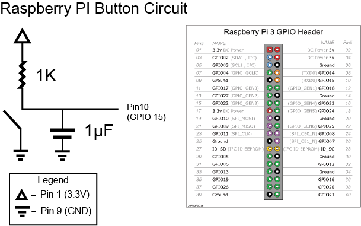

# Miniature World Sawmill Exhibit
## About
This repo is a collection of files for configuration and installation of the [PiMediaSync](https://github.com/limbicmedia/PiMediaSync) application to run the **Sawmill Exhibit** at [Miniature World](https://miniatureworld.com/), BC, Canada.

## Installation
The installation procedure for this project has been made as simple as possible. On a fresh installation of Raspbian, run:

```BASH
sudo su
export SAWMILL_VERSION=v2.0.1 # the version you wish to install, must be 2.0.0 or greater 
wget -O - https://raw.githubusercontent.com/limbicmedia/mini-world-sawmill-display/${SAWMILL_VERSION}/setup.sh | bash
```

Steps for setting up Raspbian can be found [here](https://github.com/limbicmedia/PiMediaSync).

### Installation Details
The above installation command will:
* download and install `./video/sawmill.mov` and `sawmill_config.py`
* download and install `PiMediaSync` (based on the version found in [PIMEDIASYNC_VERSION](./PIMEDIASYNC_VERSION))
* enable `PiMediaSync` at boot (using `systemd`)

By default:
* `PiMediaSync` is installed in `/opt/pimediasync`
* Sawmill files are installed in `/root/sawmill`

## Files
This repo contains 4 main files:

#### [setup.sh](./setup.sh)
This file is responsible for installing the entire project (including PiMediaSync) and configuring it to run at boot.

#### [PIMEDIASYNC_VERSION](./PIMEDIASYNC_VERSION)
This file sets the version of PiMediaSync which will be installed.

#### [sawmill_config.py](./sawmill_config.py)
This file is responsible for setting all of the necessary config variables in the PiMediaSync application. The core functionality of the exhibit is encoded in this file.

#### [sawmill.mov](./video/sawmill.mov)
This is the video file played for this exhibit.

## Interaction
The exhibit is activated by a button on the front of the display.

The code check for a FALLING edge on `GPIO15` (pin 10 of RPI) to activate the installation.

### Button Wiring
The diagram below shows the circuit wiring for the button.
A `1K` resistor acts as a pull up. The small resistance is to accommodate the long wire leads running to the button. The 1µF capacitor helps reduce noise in the system.

<br>


### System Diagram
Below is an image showing the physical setup of the system:

<br>


## Previous Versions
The previous version ([v1.0.0](https://github.com/limbicmedia/mini-world-sawmill-display/releases/tag/v1.0)) of `mini-world-sawmill-display` contained all of the code necessary to run the exhibit. Since v2.0.0, the operational code has been broken out into [PiMediaSync](https://github.com/limbicmedia/PiMediaSync). This allows for more projects to be made with the core code and the configuration and support files (i.e. audio, video, etc) stored in their own space (like this repo).